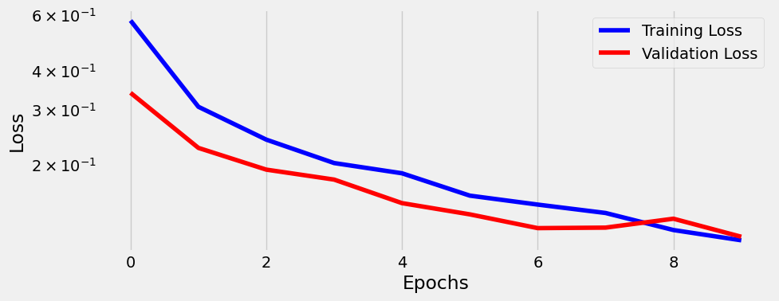
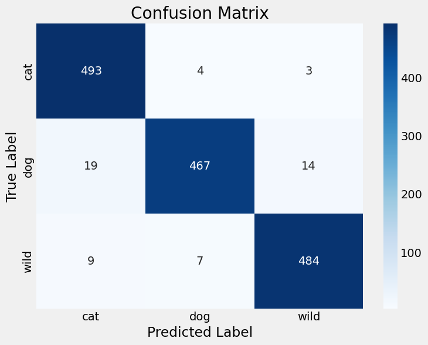
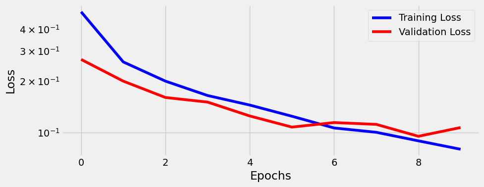
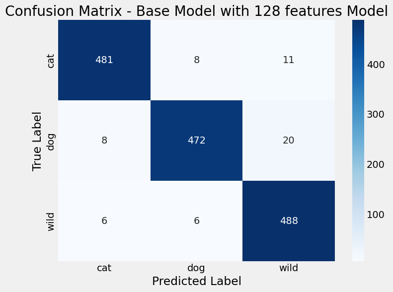
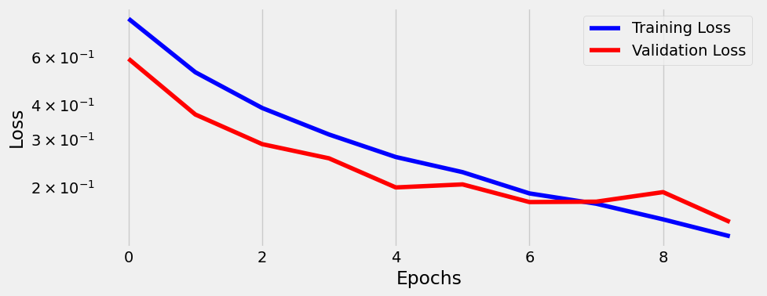
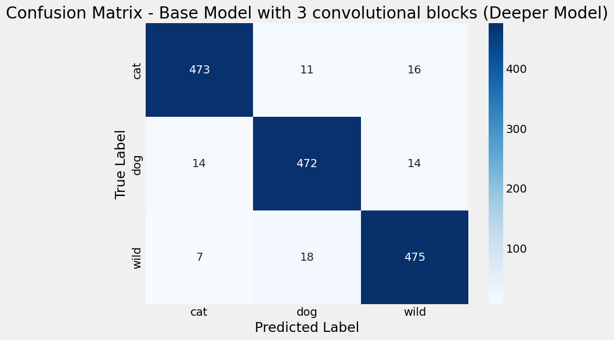
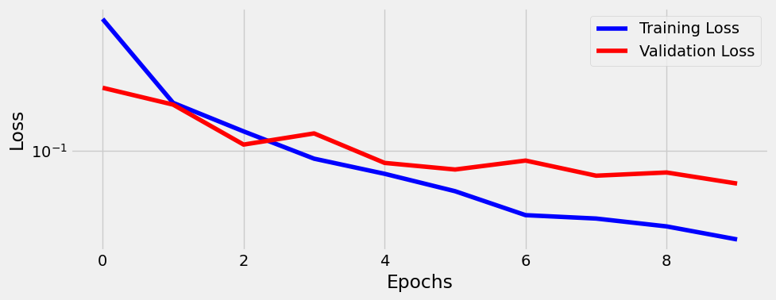
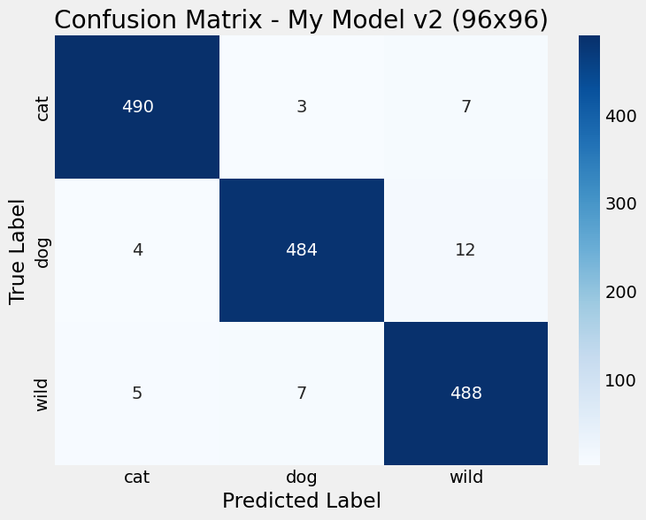
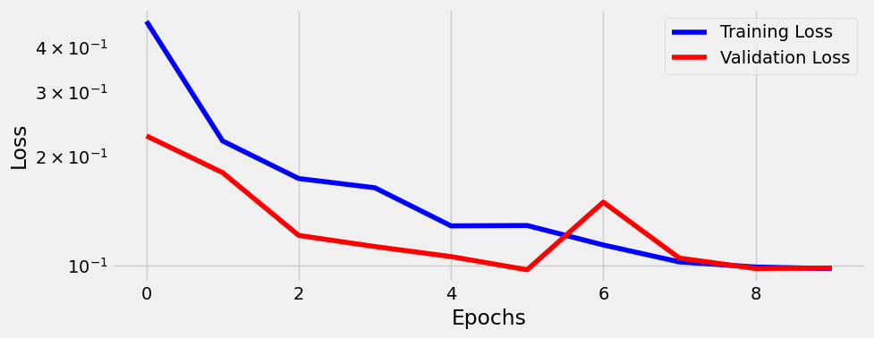
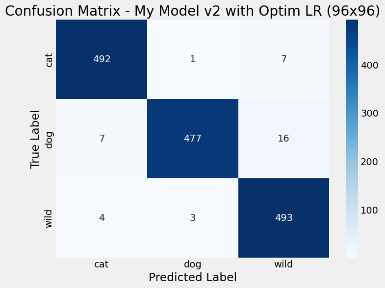

# Final Project - Animal Face Classifier (Multi-class CNN Image Classifier with Pytorch)

**Federal University of Rio Grande do Norte**  
Course: **Machine Learning** (PPGEEC2318)  
Student: **Bruno José Leal Coimbra** 

## Table of Contents

- [Final Project - Animal Face Classifier (Multi-class CNN Image Classifier with Pytorch)](#final-project---animal-face-classifier-multi-class-cnn-image-classifier-with-pytorch)
  - [Table of Contents](#table-of-contents)
  - [1. Project Overview](#1-project-overview)
  - [2. Project Summary](#2-project-summary)
  - [3. Directory Structure](#3-directory-structure)
  - [4. Problem Description](#4-problem-description)
  - [5. Dataset](#5-dataset)
  - [6. Data Load and Pre-processing](#6-data-load-and-pre-processing)
  - [7. Training Procedure](#7-training-procedure)
  - [8. Evaluate Metrics](#8-evaluate-metrics)
  - [9. Models](#9-models)
    - [9.1 Base Model](#91-base-model)
    - [9.2 Wider Model (Base Model with 128 features)](#92-wider-model-base-model-with-128-features)
    - [9.3 Deeper Model (3 CNN Blocks)](#93-deeper-model-3-cnn-blocks)
    - [9.4 My Model](#94-my-model)
  - [10. Learning Rate Optimization (Part 02)](#10-learning-rate-optimization-part-02)
    - [10.1 Experiment 5: Retraining My Model with Optimal Learning Rate](#101-experiment-5-retraining-my-model-with-optimal-learning-rate)
  - [11. Performance Comparison and Final Conclusion](#11-performance-comparison-and-final-conclusion)
    - [11.1 Final Results Summary](#111-final-results-summary)
    - [11.2 Conclusion](#112-conclusion)

## 1. Project Overview

This project is the first part of the final assignment for the Machine Learning course (PPGEEC2318) at the Federal University of Rio Grande do Norte (UFRN). The primary goal is to apply the concepts learned throughout the course to solve a multi-class image classification problem. This involves selecting a dataset, implementing and training several Convolutional Neural Network (CNN) architectures, systematically evaluating their performance, and drawing conclusions based on the experimental results.

## 2. Project Summary

This repository contains a series of experiments to classify images from the "Animal Faces (AFHQ)" dataset, which includes three classes: 'cat', 'dog', and 'wild'. Four different CNN architectures were trained and evaluated to compare how changes in model width (number of filters), depth (number of convolutional blocks), and input image resolution impact performance. The evaluation was based on metrics such as Accuracy, Precision, Recall, F1-Score, and the Confusion Matrix. The final proposed model, which utilized a deeper architecture and a higher input resolution, achieved the highest accuracy.

## 3. Directory Structure

```plaintext
ufrn-animal-face-classifier/
│
├── data/                                            # The dataset downloaded directly from Kaggle
├── images/                                          # Visualizations and model evaluation plots
│   ├── 01_cm_base_model.png
│   ├── 01_loss_base_model.png
│   ├── 01_metrics_base_model.png
│   ├── 01_hooks.png
│   ├── 02_cm_wider_model.png
│   ├── 02_loss_wider_model.png
│   ├── 02_metrics_wider_model.png
│   ├── 02_hooks.png
│   ├── 03_cm_deeper_model.png
│   ├── 03_loss_deeper_model.png
│   ├── 03_metrics_deeper_model.png
│   ├── 03_hooks.png
│   ├── 04_cm_my_model.png
│   ├── 04_loss_my_model.png
│   ├── 04_metrics_my_model.png
│   ├── 04_hooks.png
│   ├── 05_cm.png
│   ├── 05_loss.png
│   └── 05_metrics.png                       
├── model/                                           # Store trained models
│   ├── base_model_28x28.pth
│   ├── wider_model_128f_28x28.pth
│   ├── deeper_model_64f_28x28.pth
│   ├── user_model_v2_96x96.pth
│   └── user_model_v2_96x96_with_LR.pth
├── .gitignore                                       # Git file
├── notebook_01.ipynb                                # Part 1 - Main jupyter notebook with all codes and experiments
├── notebook_02.ipynb                                # Part 2 - Finding LR and training again My Model (CNN_96)
└── README.md                                        # Project description
```

## 4. Problem Description

The problem consists of a multi-class image classification task. Given an image of an animal's face, the model must correctly classify it into one of three categories: 'cat', 'dog', or 'wild'. This is a classic computer vision problem that requires the model to learn complex and subtle visual features to distinguish between classes that can be visually similar (e.g., certain dog breeds and wild canids).

## 5. Dataset

The dataset used is the **Animal Faces-HQ (AFHQ) dataset**, which was made publicly available on Kaggle. It contains a total of 16,130 high-quality 512x512 images, split into training and validation sets. For the experiments in this project, the images were resized to 28x28 and 96x96 pixels to match the input requirements of the different model architectures. The data is well-balanced across the three classes: 'cat', 'dog', and 'wild'.

This dataset was created as part of the research for the paper **"StarGAN v2: Diverse Image Synthesis for Multiple Domains"** by the authors **Yunjey Choi, Youngjung Uh, Jaejun Yoo, and Jung-Woo Ha**. It is a high-quality resource for training computer vision models, particularly for image generation tasks.

## 6. Data Load and Pre-processing

The data loading and pre-processing pipeline was designed to ensure consistency and reproducibility, starting from data acquisition directly from Kaggle within the Google Colab environment.

The keys steps in the pipeline were:

1. **Data Acquisition via Kaggle API**: To ensure a clean and efficient setup, the dataset was downloaded and unzipped directly into the Colab session using the official Kaggle API. This involved:

    - Setting up the Kaggle API token (kaggle.json) for authentication.
    - Using the command kaggle datasets download to fetch the "Animal Faces (AFHQ)" dataset.
    - Unzipping the dataset into a local /data directory.

2. **Data Loading with** ```ImageFolder```: With the data available locally, the `ImageFolder` utility was used to load the images. It automatically inferred the three classes ('cat', 'dog', 'wild') from the subfolder names in both the training and validation sets.

3. **Image Resizing**: Since the original images are 512x512 pixels, a `Resize` transformation was the first step in the image processing pipeline. Two different target resolutions were used for the experiments:
   
   - **28x28 pixels**: For the baseline, wider, and deeper model experiments (Models 1, 2, and 3).
   - **96x96 pixels**: For the final custom model (Model 4) to analyze the impact of higher input resolution.
  
4. **Tensor Conversion and Standardization**: Images were converted to PyTorch tensors with pixel values scaled to a `[0.0, 1.0]` range. A custom normalization was then applied, using the mean and standard deviation calculated **exclusively on the training set** for each specific resolution (28x28 and 96x96).
   
5. **DataLoaders**: Finally, `DataLoader` objects were created for both the training and validation sets. The training data loader used `shuffle=True` to randomize the order of images in each epoch, which helps improve model generalization. The batch size was set to 32 for all experiments.

No data augmentation techniques (like random flips or rotations) were applied in this part of the project to ensure a fair and direct comparison between the different model architectures.

## 7. Training Procedure

All models were trained using a consistent and structured procedure, managed by a custom `Architecture` class. This ensured that each experiment was conducted under the same conditions, allowing for a fair comparison of results.

The key aspects of the training procedure were:

- **Framework**: The entire project was implemented using **PyTorch**.
  
- **Hardware**: All training sessions were performed on a **GPU** accelerator within the Google Colab environment to ensure efficient computation.
- **Optimizer**: The Adam optimizer was used for all experiments, with a learning rate of `lr=3e-4`. Adam was chosen for its adaptive learning rate capabilities, which generally lead to faster convergence and robust performance.
- **Loss Function**: As this is a multi-class classification problem, the `CrossEntropyLoss` function was used.
- **Epochs**: Each model was trained for a fixed number of **10 epochs**. This provided sufficient time for the models to learn from the data while also allowing for the observation of training dynamics, such as the onset of overfitting.
- **Evaluation Loop**: After each training epoch, the model's performance was immediately evaluated on the separate validation set. Both the training loss and validation loss were recorded at each epoch to monitor the learning process and analyze model generalization.

This standardized procedure was applied to each of the four experimental models to generate the results presented in the following sections.

## 8. Evaluate Metrics

To ensure a comprehensive and fair comparison between the different model architectures, a set of standard classification metrics was used. The models were evaluated on the validation set, which was kept separate during the entire training process.

The following metrics were used:

- **Accuracy**: This metric provides a single-value summary of the model's overall performance. It is calculated as the ratio of correctly classified images to the total number of images in the validation set. While useful, it can sometimes be misleading in datasets with class imbalances, so it was used in conjunction with other metrics.
  
- **Classification Report (Precision, Recall & F1-Score)**: To get a more granular view of the performance for each individual class ('cat', 'dog', 'wild'), a detailed classification report was generated. This report includes: 
  - **Precision**: Measures the accuracy of the positive predictions. It answers the question: "Of all the images that the model labeled as 'cat', how many were actually cats?"
  - **Recall**: Measures the ability of the model to find all the relevant instances of a class. It answers the question: "Of all the actual 'cat' images in the dataset, how many did the model correctly identify?"
  - **F1-Score**: This is the harmonic mean of Precision and Recall, providing a single score that balances both metrics. It is particularly useful for comparing the performance of models on a per-class basis. 
- **Confusion Matrix**: This was the primary tool for a qualitative analysis of the model's behavior. The confusion matrix is a grid that visualizes the performance by showing the number of correct and incorrect predictions for each class. The diagonal elements represent correct classifications, while the off-diagonal elements show where the model is getting confused (e.g., predicting 'dog' when the true label was 'wild'). This allowed for a detailed error analysis for each experiment.

## 9. Models

This section details the architecture, training results, and evaluation metrics for each of the four models tested in this project.

### 9.1 Base Model

- Architecture: `CNN2`
- Input Image Size: 28x28
- Number of Features (`n_feature`): `64`
- Dropout Rate (`p`): `0.5`

**Description**:
This model serves as the baseline for all experiments. It uses a standard two-block CNN architecture. Each block consists of a convolution layer, a ReLU activation, and a max-pooling layer. Dropout regularization (p=0.5) was included to establish a strong, generalizable baseline.

**Hooks**: [Click here](./images/01_hooks.png) to view the hooks for experimenter 1 model.

**Results**:

- Overall Accuracy: 96.27%
- Precision (Macro Avg): 0.96
- Recall (Macro Avg): 0.96
- F1-Score (Macro Avg): 0.96

**Loss Curve**:



**Confusion Matrix**:



**Analysis**:
The base model achieved an excellent accuracy of 96.27%, establishing a very strong performance benchmark. The loss curve shows healthy learning, with the validation loss consistently decreasing alongside the training loss, indicating good generalization. The confusion matrix reveals the model's primary challenge is a slight confusion between the 'dog' and 'wild' classes, which is expected due to their visual similarities. This result confirms the architecture is well-suited for the task and serves as a solid point of comparison for the subsequent experiments.

### 9.2 Wider Model (Base Model with 128 features)

- Architecture: `CNN2`
- Input Image Size: 28x28
- Number of Features (`n_feature`): `128`
- Dropout Rate (`p`): `0.5`

**Description**:
In this experiment, the number of feature maps in the convolutional layers was doubled from 64 to 128. The goal was to test the hypothesis that a "wider" model with more capacity could learn a richer set of features and improve classification performance. Dropout was kept at 0.5 to control for the increased risk of overfitting due to the higher number of parameters.

**Hooks**: [Click here](./images/02_hooks.png) to view the hooks for experimenter 2 model.

**Results**:
- Overall Accuracy: 96.07%
- Precision (Macro Avg): 0.96
- Recall (Macro Avg): 0.96
- F1-Score (Macro Avg): 0.96

**Loss Curve**:



**Confusion Matrix**:



**Analysis**:
The wider model achieved an accuracy of 96.07%, a result that is statistically very similar to the 96.27% of the base model. The loss curve shows a healthy training dynamic, similar to the base model. The confusion matrix also reveals a nearly identical error pattern, with the main confusion occurring between the 'dog' and 'wild' classes. This experiment suggests that increasing the model's width (capacity) from 64 to 128 features did not yield a significant performance improvement for this dataset at this resolution, indicating that 64 filters were likely sufficient to capture the necessary visual patterns.


### 9.3 Deeper Model (3 CNN Blocks)

- Architecture: `CNN3`
- Input Image Size: 28x28
- Number of Features (`n_feature`): `64`
- Dropout Rate (`p`): `0.5`

**Description**:
This experiment tested the hypothesis that a deeper network could achieve better performance. A third convolutional block (`CONV -> RELU -> POOL`) was added to the base architecture. This modification makes the model deeper, allowing it to potentially learn a more complex hierarchy of features, while paradoxically reducing the total number of trainable parameters due to the smaller feature map size entering the classifier.

**Hooks**: [Click here](./images/03_hooks.png) to view the hooks for experimenter 3 model.

**Results**:
- Overall Accuracy: 94.67%
- Precision (Macro Avg): 0.95
- Recall (Macro Avg): 0.95
- F1-Score (Macro Avg): 0.95

**Loss Curve**:



**Confusion Matrix**:



**Analysis**: The deeper `CNN3` model achieved a final accuracy of 94.67%. While still a strong result, this is a noticeable drop in performance compared to the shallower `CNN2` models. The loss curve shows that the model began to overfit after approximately 8 epochs, as the validation loss started to increase while the training loss continued to decrease. The confusion matrix shows an increase in misclassifications, particularly between 'dog' and 'wild'. This suggests that for the 28x28 resolution, the additional depth and spatial reduction were detrimental, likely causing the model to lose important features before the classification stage.

### 9.4 My Model

- Architecture: `CNN_96` (Deeper, 3-Block Model)
- Input Image Size: 96x96
- Number of Features (`n_feature`): `64`
- Dropout Rate (`p`): `0.5`

**Description**:
This final experiment was designed to test the hypothesis that providing the model with more detailed input data would yield the best performance. The architecture was deepened to three convolutional blocks (`CNN_96`) to efficiently process the larger 96x96 input images. This model combines the insights from previous experiments: using a deeper network that is still parameter-efficient, applying robust dropout regularization, and leveraging higher-resolution images.

**Hooks**: [Click here](./images/04_hooks.png) to view the hooks for experimenter 4 model.

**Results**:

- Overall Accuracy: 97.47%
- Precision (Macro Avg): 0.97
- Recall (Macro Avg): 0.97
- F1-Score (Macro Avg): 0.97

**Loss Curve**:



**Confusion Matrix**:



**Analysis**:
This model achieved the highest accuracy of all experiments, at **97.47%**. The loss curve demonstrates a very healthy and stable training process, with the validation loss closely tracking the training loss, indicating excellent generalization. The confusion matrix shows the lowest number of misclassifications, confirming the model's superior performance. The success of this model confirms the initial hypothesis: the key limiting factor for this problem was the input image resolution. By providing more detailed images (96x96) to a sufficiently deep and well-regularized architecture, the model was able to learn more discriminative features and achieve the best overall results.

 
## 10. Learning Rate Optimization (Part 02)

After identifying the most promising architecture (`CNN_96` with 96x96 images), the second part of the project focused on systematically optimizing the training process. The goal was to use a Learning Rate Finder (LRF) to determine the optimal learning rate, rather than relying on a default value, and verify if this could further improve the model's performance.

### 10.1 Experiment 5: Retraining My Model with Optimal Learning Rate

* Architecture: `CNN_96` (Deeper, 3-Block Model)
* Input Image Size: 96x96
* Number of Features (`n_feature`): `64`
* Dropout Rate (`p`): `0.5`
* Optimal Learning Rate: `2.96e-3` (found via LR Finder)

**Description:**
The `torch-lr-finder` library was used to perform a learning rate range test on the untrained `CNN_96` architecture. The test suggested an optimal learning rate of approximately `2.96e-3`. This final experiment involves retraining the best-performing architecture from scratch using this new, systematically found learning rate.

**Results**:

- Overall Accuracy: 97.47%
- Precision (Macro Avg): 0.98
- Recall (Macro Avg): 0.97
- F1-Score (Macro Avg): 0.97

**Loss Curve:**



**Confusion Matrix:**



**Analysis**:
The model retrained with the optimal learning rate achieved a final accuracy of **97.47%**. This result is statistically on par with the previous experiment, confirming that the initial learning rate of `3e-4` was already very effective. The primary benefit of this final step was to validate the training process, demonstrating that the chosen hyperparameters are robust and systematically verified. The confusion matrix shows a very low number of errors, with the model performing exceptionally well across all three classes. This confirms that the `CNN_96` architecture with a 96x96 input resolution is the best approach for this problem among the tested configurations.

## 11. Performance Comparison and Final Conclusion

This section provides a comparative analysis of the four models trained in this project. The goal was to systematically evaluate how architectural changes, such as width, depth, and input resolution, affect the final performance on the "Animal Faces (AFHQ)" classification task.

### 11.1 Final Results Summary

The table below summarizes the key performance metrics for each of the four models on the validation set.

| Exp. | Model | Architecture |	Features |	Image Size |	Dropout |	Validation Accuracy	| Key Finding |
|------|-------|--------------|----------|-------------|----------|---------------------|-------------|
| 1 | Base Model |	CNN2 |	64 |	28x28 |	0.5 |	96.27% |	Established a strong performance baseline. |
| 2 |Wider Model|	CNN2	|128	|28x28|	0.5|	96.07%	|Increasing width did not improve performance.|
|3| Deeper Model|	CNN3|	64|	28x28|	0.5|	94.67%|	Increasing depth was detrimental at this resolution.|
| 4| My Model|	CNN_96|	64|	96x96|	0.5|	**97.47%**|	**Best performance.** Higher resolution was the key factor.|
| 5| My Model Optim LR (lr=2.96e-3) | CNN_96 | 64| 96x96| 0.5| 97.47%| Confirmed robustness of the final model with a systematic LR.|


### 11.2 Conclusion

The series of experiments led to a clear and insightful conclusion. An initial **Base Model** (`CNN2` with dropout) established a strong benchmark with **96.27%** accuracy. Experiments to increase the model's capacity by making it **wider** (128 features) or **deeper** (`CNN3`) did not yield better results for the 28x28 input resolution. In fact, the deeper model showed a significant drop in performance to **94.67%**, likely due to excessive spatial information loss from the additional pooling layer.

The most significant performance gain was achieved in **Experiment 4**, by increasing the input image resolution to **96x96**. This allowed the model to leverage more detailed visual features, reaching a new peak accuracy of **97.47%**. This confirmed the hypothesis that the quality of the input data was a key limiting factor.

Finally, **Experiment 5** validated this result by systematically finding an optimal learning rate of `2.96e-3` using a Learning Rate Finder. Retraining the final model with this new `lr` produced the same excellent accuracy, adding a higher degree of confidence and robustness to the final result.

Ultimately, the project demonstrates that a successful CNN design is a balance between an architecture's capacity, the quality of the data it processes, and the systematic optimization of hyperparameters.